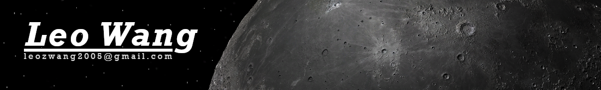

oh no

## Experiences
###  🛰️ NASA Intern Summers of [2021](https://github.com/vickicarrica/Mission-Visualization-Toolkit), [2022](https://github.com/Andallfor/MVT/tree/099db59c9d8cf9aeecfec4b884b331a979a7c158), [2023](https://github.com/Andallfor/MVT)
###  💻 Making [Games](https://github.com/Andallfor/pythonista-FLL-2019-States), [Simulations](https://github.com/Andallfor/Barnes-Hut-Simulation), and [Scientific Applications](https://github.com/Andallfor/MVT)
###  🕹️ [~~Abandoning~~](https://github.com/Andallfor/Andallfors-Text-Engine) [~~Projects~~](https://github.com/Andallfor/rts) *Coding* Since [2018](https://github.com/Andallfor/pythonista-platformer)

## Languages:

#

[Images and Moon Created By Me](https://github.com/Andallfor/MVT)
