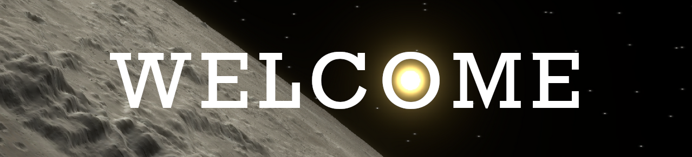
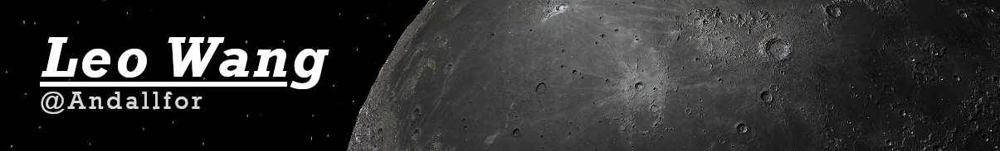

### A kid with too much free time

##

## Experiences
### 🛰️ NASA Intern Summers of [2021](https://github.com/vickicarrica/Mission-Visualization-Toolkit), [2022](https://github.com/Andallfor/MVT), 2023
### 🦾 FTC Team [Dejava #11695](https://instagram.com/dejava11695)
### 💻Making [Games](https://github.com/Andallfor/pythonista-FLL-2019-States), [Simulations](https://github.com/Andallfor/RPS), and [Scientific Applications](https://github.com/Andallfor/MVT)
### 🕹️ ~~[Abandoning](https://github.com/Andallfor/Andallfors-Text-Engine) [Projects](https://github.com/Andallfor/rts)~~ Coding Since [2018](https://github.com/Andallfor/pythonista-platformer)

## Languages:

## Tools:

#

[Images Generated In MVT](https://github.com/Andallfor/MVT)